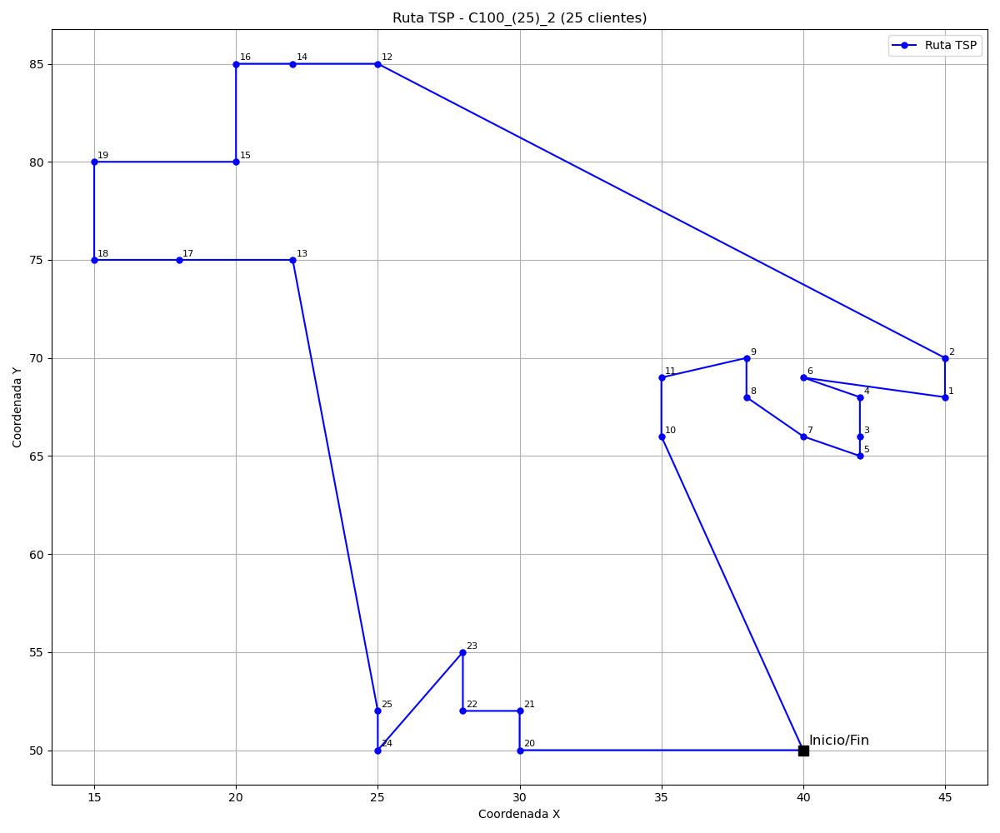
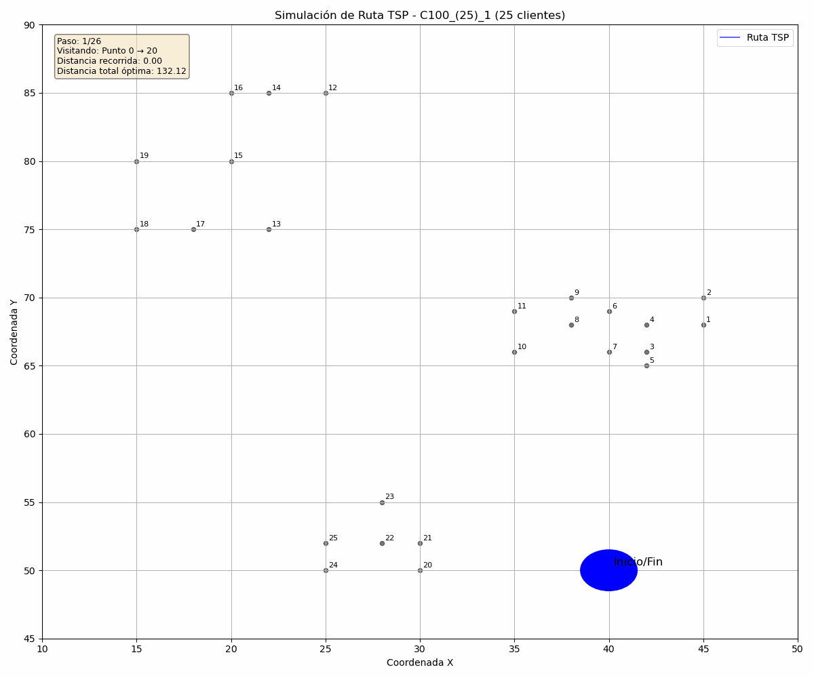

# 🚚 Optimización Híbrida para el TSP: ACO con Refinamiento SA y Calibración Automática mediante DE"

Este proyecto implementa una solución híbrida para el Problema del Viajante (TSP), utilizando el algoritmo Ant Colony Optimization (ACO) para generar rutas iniciales, el Recocido Simulado (SA) para refinarlas, y todo el proceso optimizado automáticamente mediante el Algoritmo Evolutivo Diferencial (DE).

## 🧩 ¿Qué es el TSP?

El Problema del Viajante (TSP, por sus siglas en inglés "Traveling Salesman Problem") es uno de los problemas clásicos más conocidos en optimización combinatoria.

Consiste en encontrar la ruta más corta posible que permita a un viajante visitar una serie de ciudades o clientes **exactamente una vez** y regresar al punto de partida.

## 🐜 ¿Qué es ACO (Ant Colony Optimization)?

ACO (Ant Colony Optimization) es una metaheurística inspirada en el comportamiento colectivo de las colonias de hormigas.

En la naturaleza, las hormigas encuentran caminos cortos entre su nido y las fuentes de comida dejando feromonas. Cuanto mejor sea el camino (más corto), más feromonas se acumulan, y más probable es que otras hormigas lo sigan, reforzando así la solución.

En el TSP, simulamos este comportamiento:

- Cada "hormiga" construye una solución recorriendo ciudades o clientes.
- Las decisiones se toman con base en:
  - **Cantidad de feromona** (lo aprendido)
  - **Visibilidad** (inverso de la distancia)
- Después de cada iteración, se actualizan las feromonas, favoreciendo los caminos más cortos.

## 🔥 ¿Qué es el Recocido Simulado (SA)?

El Recocido Simulado (Simulated Annealing, SA) es una metaheurística inspirada en el proceso metalúrgico de recocido, donde un metal se calienta y luego se enfría controladamente para modificar sus propiedades físicas.
En optimización:

Inicialmente acepta soluciones peores con alta probabilidad (temperatura alta)
Gradualmente se vuelve más selectivo (enfriamiento)
Este enfoque permite escapar de óptimos locales y explorar más ampliamente el espacio de soluciones

En nuestro sistema, SA toma las rutas generadas por ACO y las refina mediante pequeñas modificaciones, aceptando algunas soluciones subóptimas temporalmente para potencialmente encontrar mejores soluciones globales.

## 🧬 ¿Qué es el Algoritmo Evolutivo Diferencial (DE)?

DE es una técnica de optimización basada en poblaciones. Ideal para problemas continuos y para ajustar parámetros automáticamente.

📌 Se basa en tres operadores:

Mutación – Combinación de soluciones existentes.

Cruzamiento (recombinación) – Mezcla de individuo mutado y original.

Selección – Se elige el más apto entre ambos.

## 🧠 ¿Cómo se resolvió el TSP?

El enfoque fue **híbrido** con tres algortimos:

- **ACO** resuelve el TSP directamente.
- **SA** refina las rutas generadas por ACO.
- **DE** encuentra los mejores parámetros para ambos algoritmos.

## ⚙️ Rango de Parámetros Adaptativos según el Tamaño del Problema

Para lograr una **mejor calibración** de los algoritmos ACO (Ant Colony Optimization) y SA (Simulated Annealing), se definieron **rangos de parámetros adaptativos** en función del número de clientes en la instancia del TSP.

Esto permite que los algoritmos se ajusten de forma dinámica, dependiendo de la complejidad del problema (tamaño de la instancia).

---

### 🔢 Tamaños de instancia considerados

| Tamaño del problema | Número de clientes (`tsp->num_clientes`) |
|---------------------|-------------------------------------------|
| **Pequeña**         | `≤ 25`                                    |
| **Mediana**         | `> 25 y ≤ 51`                              |
| **Grande**          | `> 51 y ≤ 101`                             |

---

### 📐 Rangos de Parámetros por Tamaño

#### 🔸 Instancia Pequeña (`≤ 25 clientes`)

| Parámetro                 | Mínimo | Máximo |
|---------------------------|--------|--------|
| `alpha`                   | 0.8    | 2.5    |
| `beta`                    | 2.5    | 6.0    |
| `rho`                     | 0.1    | 0.5    |
| `número de hormigas`      | 10     | 25     |
| `iteraciones ACO`         | 100    | 150    |
| `temperatura inicial`     | 200.0  | 400.0  |
| `temperatura final`       | 0.01   | 0.1    |
| `factor de enfriamiento`  | 0.95   | 0.98   |
| `iteraciones SA`          | 30     | 50     |

---

#### 🔸 Instancia Mediana (`26 - 51 clientes`)

| Parámetro                 | Mínimo | Máximo |
|---------------------------|--------|--------|
| `alpha`                   | 0.8    | 2.5    |
| `beta`                    | 2.5    | 6.0    |
| `rho`                     | 0.1    | 0.5    |
| `número de hormigas`      | 20     | 40     |
| `iteraciones ACO`         | 150    | 200    |
| `temperatura inicial`     | 400.0  | 600.0  |
| `temperatura final`       | 0.01   | 0.1    |
| `factor de enfriamiento`  | 0.95   | 0.98   |
| `iteraciones SA`          | 50     | 80     |

---

#### 🔸 Instancia Grande (`52 - 101 clientes`)

| Parámetro                 | Mínimo | Máximo |
|---------------------------|--------|--------|
| `alpha`                   | 0.8    | 2.0    |
| `beta`                    | 3.0    | 6.0    |
| `rho`                     | 0.1    | 0.3    |
| `número de hormigas`      | 60     | 120    |
| `iteraciones ACO`         | 500    | 500    |
| `temperatura inicial`     | 600.0  | 1000.0 |
| `temperatura final`       | 0.01   | 0.1    |
| `factor de enfriamiento`  | 0.98   | 0.995  |
| `iteraciones SA`          | 100    | 150    |

---

### 🧠 ¿Por qué definir rangos diferentes?

Esto permite que el algoritmo DE explore soluciones **más ajustadas al tamaño del problema**, evitando usar configuraciones demasiado pequeñas para instancias grandes, o demasiado costosas para instancias pequeñas. De esta manera se logra un **balance entre calidad de la solución y tiempo de cómputo.**

---

## 🔁 Proceso combinado DE + ACO + SA

1. **DE** genera aleatoriamente una población de conjuntos de parámetros (α, β, ρ, etc.).
2. Cada conjunto se **evalúa** ejecutando **ACO** (con SA en algunos casos como optimizador local).
3. Se obtiene la **distancia total de la mejor ruta** generada por ACO.
4. DE **evoluciona** la población para **minimizar la distancia** encontrada.
5. El proceso se repite hasta alcanzar un número máximo de generaciones o una mejora mínima.

---

Este proceso permite **optimizar automáticamente** el rendimiento del algoritmo ACO (y SA), **evitando el ajuste manual** de parámetros y encontrando de manera más eficiente soluciones de alta calidad para el **Problema del Viajante (TSP)** o el **Problema de Ruteo de Vehículos (VRP)**.

## 🎯 Resultados Esperados

El objetivo principal de este proyecto es encontrar la mejor ruta para el **Problema del Viajante de Comercio (TSP)** mediante el uso combinado del algoritmo **ACO** y el algoritmo **DE**, el cual optimiza automáticamente los parámetros del ACO y del Recocido Simulado (SA).

---

### 🔍 ¿Qué se espera como salida?

1. **La mejor ruta encontrada**  
   La ruta óptima, que minimiza la distancia total recorrida.

2. **Tiempo de ejecución total**  
   El tiempo total que tomó ejecutar el proceso de optimización y encontrar la mejor ruta.

---

### 📦 Resultados Generados

3. **Archivo JSON**

   - Se genera un archivo `.json` que contiene todos los **parámetros optimizados automáticamente** durante la ejecución, tales como:
     - Nombre del archivo de entrada
     - Tiempo de ejecución en minutos
     - Población y generaciones del DE
     - Parámetros de ACO (`α`, `β`, `ρ`, número de hormigas, iteraciones ACO)
     - Parámetros de SA (temperatura inicial, final, factor de enfriamiento, iteraciones SA)
     - Valor de fitness de la solución
     - Ruta generada (lista de ciudades o clientes visitados)

4. **Imagen simulada**

   - Se genera una imagen estática (`.png`) que representa visualmente la **ruta generada** por el algoritmo ACO.

   Ejemplo de visualización:
   

5. **GIF simulado**

   - Se crea un **GIF animado** que simula el proceso de construcción de la ruta, mostrando cómo la mejor hormiga recorre las ciudades o clientes a lo largo del tiempo.

   Ejemplo de animación:
   

---

### 💾 Ejemplo de archivo JSON

El archivo `JSON` generado tendrá una estructura como la siguiente:

```json
{
  "Archivo": "C101",
  "Tiempo Ejecucion en Minutos": 2,
  "Poblacion": 10,
  "Generaciones": 10,
  "Alpha": 2.3476589154906842,
  "Beta": 2.3577138539323181,
  "Rho": 0.2498495201812356,
  "Numero Hormigas": 35,
  "Numero Iteraciones ACO": 100,
  "Temperatura Inicial": 748.30022249291665,
  "Temperatura Final": 0.1,
  "Factor de Enfriamiento": 0.99,
  "Numero Iteraciones SA": 99,
  "Fitness Global": 132.12162500340892,
  "Ruta Clientes": [
    0, 20, 21, 22, 24, 25, 23, 13, 17, 18, 19, 15, 16, 14, 12, 11, 10, 8, 9, 6,
    4, 2, 1, 3, 5, 7, 0
  ]
}
```

## Requisitos

Para ejecutar este proyecto, asegúrate de tener lo siguiente:

### 🧑‍💻 C Compiler

Es necesario tener un compilador de C instalado (como gcc) para compilar el código fuente.

### Librería `cJSON`:

Este proyecto requiere la librería `cJSON` para trabajar con archivos JSON en C.  
 Puedes encontrarla y consultar cómo instalarla en su repositorio oficial:

👉 [https://github.com/DaveGamble/cJSON](https://github.com/DaveGamble/cJSON)

### 📦 Python

Asegúrate de tener Python instalado junto con las siguientes bibliotecas:

- json
- os
- sys
- matplotlib
- numpy

## Compilación y Ejecución

### 1. **Compilación**

Para compilar el proyecto, usa el siguiente comando:

```bash
make
```

Este comando compilará el código en modo release por defecto (optimizado). Si prefieres compilar en modo debug para facilitar la depuración, puedes usar:

```bash
make debug
```

### 2. Ejecutar el Programa

Una vez compilado el proyecto, puedes ejecutar el ejecutable generado (llamado main) con los siguientes parámetros:

```bash
./main <poblacion> <generaciones> <archivo> <numero_de_clientes>
```

Ejemplo:

```bash
./main 50 100 C100 25
```

- poblacion: el tamaño de la población para el algoritmo.

- generaciones: el número de generaciones que el algoritmo debe ejecutar.

- archivo: el archivo de entrada.

- numero_de_clientes: el número de clientes o ciudades a considerar en el TSP.

### 3. Limpieza

Si deseas limpiar los archivos generados (archivos objeto, ejecutables, etc.), puedes usar:

```bash
make clean
```

## 📁 Estructura del Proyecto

```bash
.
├── build/                     # Archivos objetos y dependencias generados por el compilador
├── include/                  # Archivos de cabecera (.h)
│   ├── aed.h
│   ├── configuracion_json.h
│   ├── configuracion_tsp.h
│   ├── control_memoria.h
│   ├── estructuras.h
│   ├── lista_flota.h
│   ├── lista_ruta.h
│   ├── salida_datos.h
│   ├── tsp_sa.h
│   └── vrp_aco.h
├── Instancias/               # Instancias CSV utilizadas en la ejecución
│   ├── Instancias_25/
│   ├── Instancias_50/
│   └── Instancias_100/
├── main                      # Ejecutable generado tras compilar
├── makefile                  # Makefile para compilar el proyecto
├── README.md                 # Archivo de documentación
├── Resultados/               # Salidas generadas por la ejecución
│   ├── Resultados_25/
│   │   ├── Gifs/
│   │   ├── Imagenes/
│   │   └── Json/
│   ├── Resultados_50/
│   │   ├── Gifs/
│   │   ├── Imagenes/
│   │   └── Json/
│   └── Resultados_100/
│       ├── Gifs/
│       ├── Imagenes/
│       └── Json/
├── src/                      # Código fuente del proyecto en C y Python
│   ├── aed.c
│   ├── configuracion_json.c
│   ├── configuracion_tsp.c
│   ├── control_memoria.c
│   ├── lista_flota.c
│   ├── lista_ruta.c
│   ├── main.c
│   ├── salida_datos.c
│   ├── tsp_sa.c
│   ├── vrp_aco.c
│   └── Simulador_TSP/
│       └── simulador_tsp.py
└── VRP_Solomon/              # Instancias del benchmark Solomon
    ├── VRP_Solomon_25/
    │   ├── C100_(25).txt
    │   ├── C200_(25).txt
    │   ├── R100_(25).txt
    │   ├── R200_(25).txt
    │   ├── RC100_(25).txt
    │   └── RC200_(25).txt
    ├── VRP_Solomon_50/
    │   ├── C100_(50).txt
    │   ├── C200_(50).txt
    │   ├── R100_(50).txt
    │   ├── R200_(50).txt
    │   ├── RC100_(50).txt
    │   └── RC200_(50).txt
    └── VRP_Solomon_100/
        ├── C100_(100).txt
        ├── C200_(100).txt
        ├── R100_(100).txt
        ├── R200_(100).txt
        └── RC100_(100).txt
```

### ✅ Consideraciones finales

Este trabajo busca contribuir al estudio y solución del problema TSP mediante la implementación de algoritmos bioinspirados. Se invita a la comunidad a explorar, reutilizar y mejorar el código según sus necesidades.

## 👥 Contribuciones

- 🧑‍🏫 **Dr. Edwin Montes Orozco**  
  Director de PT y responsable del acompañamiento académico durante el desarrollo del proyecto.

- 👨‍💻 **Alejandro Martínez Guzmán**  
  Autor del proyecto. Encargado del diseño, implementación y documentación del sistema de optimización.

- 🧪 **Jaime López Lara**  
  Ayudante en la ejecución del código y recolección de resultados.

## 📝 Licencia

Este proyecto está licenciado bajo los términos de la licencia MIT.  
Consulta el archivo [LICENSE](./LICENSE) para más detalles.
