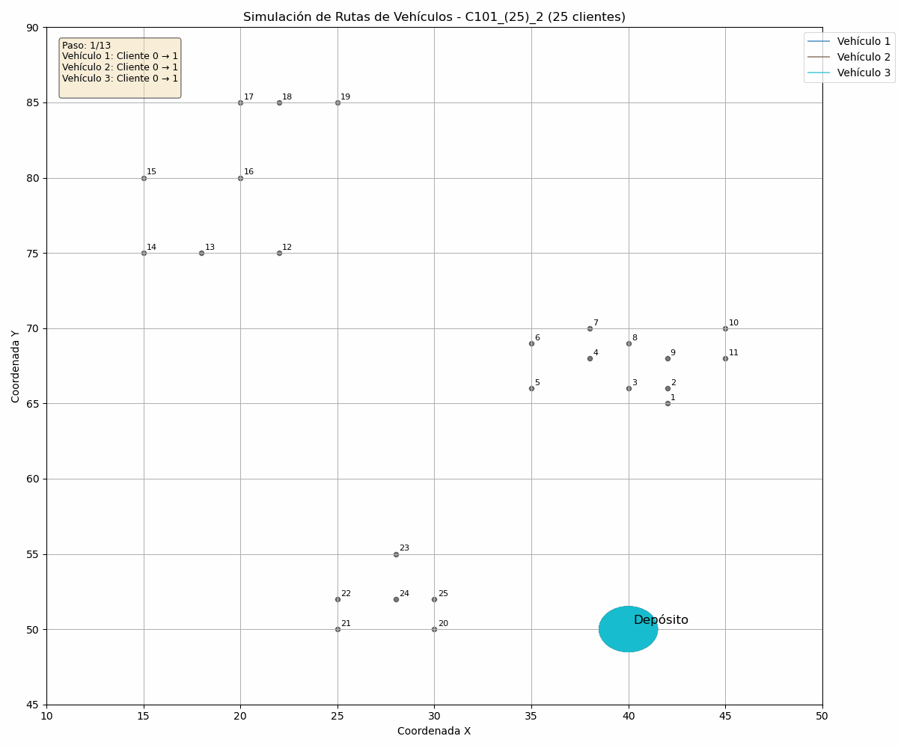

# 🚚 Resolución del VRPTW con ACO optimizado por DE

Este proyecto implementa una solución híbrida para el Problema de Rutas de Vehículos con Ventanas de Tiempo (VRPTW), utilizando el algoritmo Ant Colony Optimization (ACO) optimizado automáticamente mediante el Algoritmo Evolutivo Diferencial (DE).

## 🧩 ¿Qué es el VRPTW?

El Problema de Rutas de Vehículos con Ventanas de Tiempo (VRPTW, por sus siglas en inglés "Vehicle Routing Problem with Time Windows") es una extensión del Problema de Rutas de Vehículos (VRP) clásico que añade restricciones temporales.

Consiste en encontrar las rutas óptimas para una flota de vehículos que deben visitar un conjunto de clientes dentro de intervalos de tiempo específicos (ventanas de tiempo), considerando también restricciones de capacidad de carga y la demanda de cada cliente, con el objetivo de minimizar la distancia total recorrida.

## 🕒 Restricciones de Ventanas de Tiempo

Cada cliente debe ser visitado dentro de una ventana de tiempo específica:

- **Tiempo más temprano** (earliest time): El vehículo no puede comenzar el servicio antes de este tiempo.
- **Tiempo más tardío** (latest time): El vehículo debe comenzar el servicio a más tardar en este tiempo.

Si un vehículo llega antes del tiempo más temprano, debe esperar. Si no puede llegar antes del tiempo más tardío, la solución no es factible.

## 🐜 ¿Qué es ACO (Ant Colony Optimization)?

ACO (Ant Colony Optimization) es una metaheurística inspirada en el comportamiento colectivo de las colonias de hormigas.

En la naturaleza, las hormigas encuentran caminos cortos entre su nido y las fuentes de comida dejando feromonas. Cuanto mejor sea el camino (más corto), más feromonas se acumulan, y más probable es que otras hormigas lo sigan, reforzando así la solución.

En el VRPTW, simulamos este comportamiento:

- Cada "hormiga" construye una solución recorriendo clientes.
- Las decisiones se toman con base en:
  - **Cantidad de feromona** (lo aprendido)
  - **Visibilidad** (inverso de la distancia)
  - **Factibilidad temporal** (ventanas de tiempo)
- Después de cada iteración, se actualizan las feromonas, favoreciendo los caminos más cortos y temporalmente viables.
- Se respetan las **restricciones de capacidad y tiempo** de cada vehículo.

## 🧬 ¿Qué es el Algoritmo Evolutivo Diferencial (DE)?

DE es una técnica de optimización basada en poblaciones. Ideal para problemas continuos y para ajustar parámetros automáticamente.

📌 Se basa en tres operadores:

Mutación – Combinación de soluciones existentes.

Cruzamiento (recombinación) – Mezcla de individuo mutado y original.

Selección – Se elige el más apto entre ambos.

## 🧠 ¿Cómo se resolvió el VRPTW?

El enfoque fue **híbrido**:

- **ACO** resuelve el VRPTW directamente, respetando las restricciones de capacidad y tiempo.
- **DE** encuentra los mejores parámetros para ACO.
- **Selección Greedy** de vehículos cuando se alcanza la capacidad máxima o cuando no es posible cumplir con las ventanas de tiempo.

🎯 **Parámetros optimizados por DE**:
El algoritmo Evolutivo Diferencial (DE) se utilizó para calibrar los parámetros del algoritmo ACO. Los siguientes rangos fueron considerados para cada parámetro:

- **α (alpha)**: Influencia de la feromona. Ajustado entre **1.0 y 2.5**.
- **β (beta)**: Influencia de la visibilidad (heurística). Ajustado entre **1.0 y 2.5**.
- **γ (gamma)**: Influencia de la factibilidad temporal. Ajustado entre **0.1 y 2.5**.
- **ρ (rho)**: Tasa de evaporación de feromonas. Ajustado entre **0.1 y 0.9**.
- **Número de hormigas**: Ajustado entre **20 y 100**.
- **Número de iteraciones**: Ajustado entre **50 y 200**.

### 📊 ¿Cómo se generaron los parámetros?

Durante la ejecución de DE, cada parámetro fue generado aleatoriamente dentro de los siguientes intervalos:

- **α (alpha)**: Se generó entre **1.0 y 2.5**.
- **β (beta)**: Se generó entre **1.0 y 2.5**.
- **γ (gamma)**: Se generó entre **0.1 y 2.5**.
- **ρ (rho)**: Se generó entre **0.1 y 0.9**.
- **Número de hormigas**: Se generó entre **20 y 100**.
- **Número de iteraciones**: Se generó entre **50 y 200**.

Esto permitió ajustar de manera eficiente los parámetros para obtener la mejor solución en el VRPTW sin necesidad de hacerlo manualmente.

🔁 **Proceso combinado**:

1. DE genera una población de parámetros.
2. Cada conjunto se evalúa ejecutando ACO.
3. Se obtiene la distancia total de todas las rutas generadas y el número de vehículos utilizados.
4. DE evoluciona los parámetros para minimizar la distancia total y el número de vehículos.

📈 Así se optimiza el rendimiento de ACO **sin ajustar nada manualmente**.

## 🚛 Gestión de Vehículos, Capacidad y Tiempo

La principal diferencia con respecto al VRP clásico es la incorporación de:

- **Restricciones de capacidad**: Cada vehículo tiene una capacidad máxima.
- **Demanda de clientes**: Cada cliente requiere cierta cantidad de producto.
- **Ventanas de tiempo**: Cada cliente debe ser visitado dentro de un intervalo de tiempo específico.
- **Tiempo de servicio**: Cada cliente requiere un tiempo de servicio determinado.
- **Tiempos de viaje**: El tiempo necesario para viajar entre localizaciones.
- **Selección greedy de vehículos**: Cuando un vehículo alcanza su capacidad máxima o no puede cumplir con las ventanas de tiempo restantes, se selecciona el siguiente vehículo disponible.

El algoritmo construye las rutas considerando estas restricciones:

1. Comienza desde el depósito con tiempo inicial 0.
2. Selecciona el siguiente cliente basándose en feromonas, visibilidad y factibilidad temporal.
3. Verifica si la capacidad del vehículo permite atender al cliente.
4. Verifica si el vehículo puede llegar dentro de la ventana de tiempo del cliente.
5. Actualiza el tiempo de llegada y espera si es necesario.
6. Si no es posible atender al cliente, regresa al depósito y utiliza el siguiente vehículo.
7. Continúa hasta que todos los clientes sean atendidos.

## 🎯 Resultados Esperados

El objetivo principal de este proyecto es encontrar las mejores rutas para el **Problema de Rutas de Vehículos con Ventanas de Tiempo (VRPTW)** mediante el uso combinado del algoritmo **ACO** y el algoritmo **DE** para optimizar los parámetros.

### 🔍 ¿Qué se espera como salida?

1. **Las mejores rutas encontradas**: Las rutas óptimas para cada vehículo, que minimizan la distancia total recorrida y cumplen con todas las restricciones.
2. **Tiempo de ejecución total**: El tiempo total que tomó ejecutar el proceso de optimización y encontrar las mejores rutas.
3. **Utilización de vehículos**: Cantidad de vehículos utilizados y su nivel de ocupación.
4. **Planificación temporal**: Tiempos de llegada, espera y salida para cada cliente.

### 📦 Resultados Generados

3. **Archivo JSON**

   - Se genera un archivo `.json` que contiene todos los parámetros utilizados en la ejecución, tales como:
     - Nombre del archivo de entrada
     - Tiempo de ejecución en minutos
     - α (alpha), β (beta), γ (gamma), ρ (rho)
     - Número de hormigas
     - Número de iteraciones
     - Valor de fitness de la solución
     - Flota:
        - ID_Vehiculo
        - Capacidad Maxima
        - Capacidad Acumulada
        - Tiempo Consumido
        - Tiempo Maximo
        - Numero Clientes
        - Fitness Vehiculo
        - Rutas generada(listas de clientes)

4. **Imagen simulada**

   - Se genera una imagen estática (`.png`) que representa visualmente las **rutas generadas** por el algoritmo ACO.
   - Las rutas de diferentes vehículos se representan con colores distintos.
   - Incluye información sobre las ventanas de tiempo de cada cliente.

   Ejemplo de visualización:
   

5. **GIF simulado**

   - Se crea un **GIF animado** que simula el proceso de construcción de las rutas en el tiempo, mostrando cómo los vehículos recorren los clientes respetando las ventanas de tiempo.

   Ejemplo de animación:
   

### 💾 Ejemplo de archivo JSON

El archivo `JSON` generado tendrá la siguiente estructura:

```json
{
	"Archivo":	"C101_(25)",
	"Tiempo Ejecucion en Minutos":	1,
	"Alpha":	2.01145185926531,
	"Beta":	1.1645681097472869,
	"Gamma":	1.1346780471665217,
	"Rho":	0.14182290064255842,
	"Numero Hormigas":	62,
	"Numero Iteraciones":	175,
	"Fitness Global":	191.8136197786562,
	"flota":	[{
			"Id_vehiculo":	1,
			"Capacidad Maxima":	200,
			"Capacidad Acumulada":	160,
			"Tiempo Consumido":	1236,
			"Tiempo Maximo":	1236,
			"Numero Clientes":	11,
			"Fitness Vehiculo":	59.488230933533082,
			"Ruta Clientes":	[0, 5, 3, 7, 8, 10, 11, 9, 6, 4, 2, 1, 0]
		}, {
			"Id_vehiculo":	2,
			"Capacidad Maxima":	200,
			"Capacidad Acumulada":	190,
			"Tiempo Consumido":	1236,
			"Tiempo Maximo":	1236,
			"Numero Clientes":	8,
			"Fitness Vehiculo":	95.884709130818266,
			"Ruta Clientes":	[0, 13, 17, 18, 19, 15, 16, 14, 12, 0]
		}, {
			"Id_vehiculo":	3,
			"Capacidad Maxima":	200,
			"Capacidad Acumulada":	110,
			"Tiempo Consumido":	1007.2426406871193,
			"Tiempo Maximo":	1236,
			"Numero Clientes":	6,
			"Fitness Vehiculo":	36.440679714304849,
			"Ruta Clientes":	[0, 20, 24, 25, 23, 22, 21, 0]
		}]
}
```

## Requisitos

Para ejecutar este proyecto, asegúrate de tener lo siguiente:

### 🧑‍💻 C Compiler

Es necesario tener un compilador de C instalado (como gcc) para compilar el código fuente.

### Librería `cJSON`:

Este proyecto requiere la librería `cJSON` para trabajar con archivos JSON en C.  
 Puedes encontrarla y consultar cómo instalarla en su repositorio oficial:

👉 [https://github.com/DaveGamble/cJSON](https://github.com/DaveGamble/cJSON)

### 📦 Python

Asegúrate de tener Python instalado junto con las siguientes bibliotecas:

- json
- os
- sys
- matplotlib
- numpy

## Compilación y Ejecución

### 1. **Compilación**

Para compilar el proyecto, usa el siguiente comando:

```bash
make
```

Este comando compilará el código en modo release por defecto (optimizado). Si prefieres compilar en modo debug para facilitar la depuración, puedes usar:

```bash
make debug
```

### 2. Ejecutar el Programa

Una vez compilado el proyecto, puedes ejecutar el ejecutable generado (llamado main) con los siguientes parámetros:

```bash
./main <poblacion> <generaciones> <archivo> <numero_de_clientes>
```

Ejemplo:

```bash
./main 50 100 C101 25
```

- poblacion: el tamaño de la población para el algoritmo.
- generaciones: el número de generaciones que el algoritmo debe ejecutar.
- archivo: el archivo de entrada.
- numero_de_clientes: el número de clientes a considerar en el VRPTW.

### 3. Limpieza

Si deseas limpiar los archivos generados (archivos objeto, ejecutables, etc.), puedes usar:

```bash
make clean
```

## 📁 Estructura del Proyecto

```bash
.
├── build/                     # Archivos objetos y dependencias generados por el compilador
├── include/                  # Archivos de cabecera (.h)
│   ├── aed.h
│   ├── configuracion_json.h
│   ├── configuracion_vrp_tw.h  # Modificado para VRPTW
│   ├── control_memoria.h
│   ├── estructuras.h
│   ├── lista_flota.h
│   ├── lista_ruta.h
│   ├── salida_datos.h
│   └── vrp_tw_aco.h            # Modificado para VRPTW
├── Instancias/               # Instancias CSV utilizadas en la ejecución
│   ├── Instancias_25/
│   ├── Instancias_50/
│   └── Instancias_100/
├── main                      # Ejecutable generado tras compilar
├── makefile                  # Makefile para compilar el proyecto
├── README.md                 # Archivo de documentación
├── Resultados/               # Salidas generadas por la ejecución
│   ├── Resultados_25/
│   │   ├── Gifs/
│   │   ├── Imagenes/
│   │   └── Json/
│   ├── Resultados_50/
│   │   ├── Gifs/
│   │   ├── Imagenes/
│   │   └── Json/
│   └── Resultados_100/
│       ├── Gifs/
│       ├── Imagenes/
│       └── Json/
├── src/                      # Código fuente del proyecto en C y Python
│   ├── aed.c
│   ├── configuracion_json.c
│   ├── configuracion_vrp_tw.c  # Modificado para VRPTW
│   ├── control_memoria.c
│   ├── lista_flota.c
│   ├── lista_ruta.c
│   ├── main.c
│   ├── salida_datos.c
│   ├── vrp_tw_aco.c           # Modificado para VRPTW
│   └── Simulador_VRP_TW/      # Modificado para VRPTW
│       └── simulador_vrp_tw.py
└── VRP_Solomon/              # Instancias del benchmark Solomon para VRPTW
    ├── VRP_Solomon_25/
    │   ├── C101_(25).txt
    │   ├── C201_(25).txt
    │   ├── R101_(25).txt
    │   ├── R201_(25).txt
    │   ├── RC101_(25).txt
    │   └── RC201_(25).txt
    ├── VRP_Solomon_50/
    │   ├── C101_(50).txt
    │   ├── C201_(50).txt
    │   ├── R101_(50).txt
    │   ├── R201_(50).txt
    │   ├── RC101_(50).txt
    │   └── RC201_(50).txt
    └── VRP_Solomon_100/
        ├── C101_(100).txt
        ├── C201_(100).txt
        ├── R101_(100).txt
        ├── R201_(100).txt
        └── RC101_(100).txt
```

### ✅ Consideraciones finales

Este trabajo busca contribuir al estudio y solución del problema VRPTW mediante la implementación de algoritmos bioinspirados. La principal diferencia respecto a la versión VRP clásica es la incorporación de restricciones de ventanas de tiempo, lo que añade una capa de complejidad al problema y requiere una gestión temporal durante la construcción de las rutas. Se invita a la comunidad a explorar, reutilizar y mejorar el código según sus necesidades.

## 👥 Contribuciones

- 🧑‍🏫 **Dr. Edwin Montes Orozco**  
  Director de PT y responsable del acompañamiento académico durante el desarrollo del proyecto.

- 👨‍💻 **Alejandro Martínez Guzmán**  
  Autor del proyecto. Encargado del diseño, implementación y documentación del sistema de optimización.

- 🧪 **Jaime López Lara**  
  Ayudante en la ejecución del código y recolección de resultados.

## 📝 Licencia

Este proyecto está licenciado bajo los términos de la licencia MIT.  
Consulta el archivo [LICENSE](./LICENSE) para más detalles.
