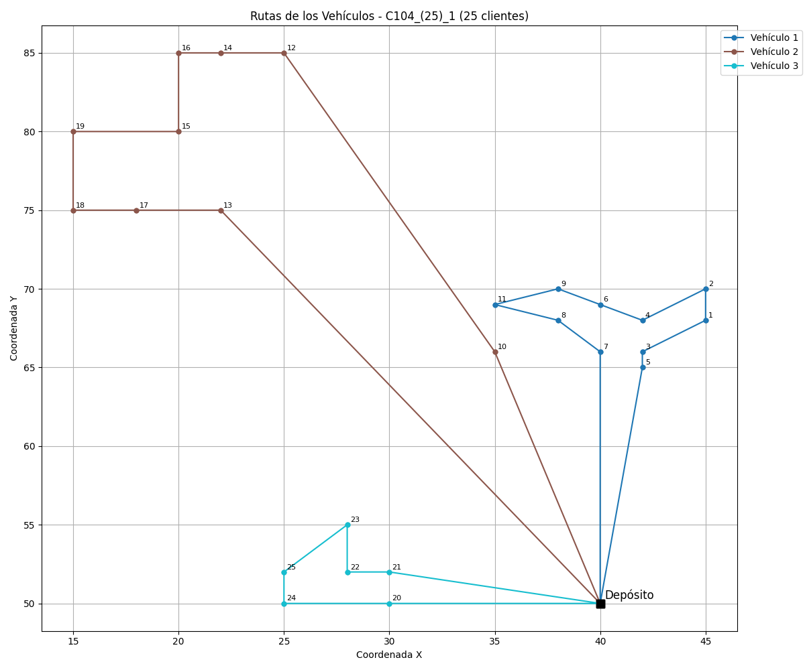

# 🚚 "Optimización del Problema de Ruteo de Vehículos con Ventanas de Tiempo (VRPTW) mediante una Metaheurística Híbrida ACO-SA con Calibración de Parámetros por Evolución Diferencial"

Este proyecto implementa una solución híbrida para el Problema de Rutas de Vehículos con Ventanas de Tiempo (VRPTW), combinando el algoritmo de Optimización por Colonias de Hormigas (**ACO**) con Recocido Simulado (**SA**) como refinador local, y ajustando automáticamente sus parámetros mediante un Algoritmo Evolutivo Diferencial (**DE**).

---

## 🧩 ¿Qué es el VRPTW?

El Problema de Rutas de Vehículos con Ventanas de Tiempo (VRPTW, por sus siglas en inglés _Vehicle Routing Problem with Time Windows_) es una extensión del Problema de Rutas de Vehículos (_VRP_) clásico que añade restricciones temporales.

Consiste en encontrar las rutas óptimas para una flota de vehículos que deben visitar un conjunto de clientes dentro de intervalos de tiempo específicos (ventanas de tiempo), considerando también restricciones de capacidad de carga y la demanda de cada cliente, con el objetivo de minimizar la distancia total recorrida.

---

## 🕒 Restricciones de Ventanas de Tiempo

Cada cliente debe ser visitado dentro de una ventana de tiempo específica:

- **Tiempo más temprano** (earliest time): El vehículo no puede comenzar el servicio antes de este tiempo.
- **Tiempo más tardío** (latest time): El vehículo debe comenzar el servicio a más tardar en este tiempo.

Si un vehículo llega antes del tiempo más temprano, debe esperar. Si no puede llegar antes del tiempo más tardío, la solución no es factible.

---

## 🐜 ¿Qué es ACO (Ant Colony Optimization)?

ACO (Ant Colony Optimization) es una metaheurística inspirada en el comportamiento colectivo de las colonias de hormigas.

En la naturaleza, las hormigas encuentran caminos cortos entre su nido y las fuentes de comida dejando feromona. Cuanto mejor sea el camino (más corto), más feromona se acumulan, y más probable es que otras hormigas lo sigan, reforzando así la solución.

En el VRPTW, simulamos este comportamiento:

- Cada "hormiga" construye una solución recorriendo clientes.
- Las decisiones se toman con base en:
  - **Cantidad de feromona** (lo aprendido)
  - **Visibilidad** (inverso de la distancia)
  - **Factibilidad temporal** (ventanas de tiempo)
- Después de cada iteración, se actualizan las feromonas, favoreciendo los caminos más cortos y temporalmente viables.
- Se respetan las **restricciones de capacidad y tiempo** de cada vehículo.

## 🔥 ¿Qué es el Recocido Simulado (SA)?

El Recocido Simulado (_Simulated Annealing_, SA) es una metaheurística inspirada en el proceso metalúrgico de recocido, donde un metal se calienta y luego se enfría de forma controlada para modificar sus propiedades físicas.

En optimización:

- Inicialmente, **acepta soluciones peores con alta probabilidad** (cuando la temperatura es alta).
- Gradualmente, **se vuelve más selectivo** a medida que la temperatura disminuye (_enfriamiento_).
- Este enfoque permite escapar de óptimos locales y explorar ampliamente el espacio de soluciones.

🔧 En nuestro sistema, **SA toma las rutas generadas por ACO y las refina** mediante pequeñas modificaciones, aceptando temporalmente algunas soluciones subóptimas para potencialmente encontrar mejores soluciones globales.

---

## 🔄 Movimientos de Vecindad del Recocido Simulado (SA)

Durante la optimización local con SA, se generan **soluciones vecinas** a partir de la solución actual mediante uno de los siguientes tres movimientos aleatorios:

1. **Mover dos clientes entre vehículos:**  
   Se seleccionan dos clientes pertenecientes a vehículos distintos y se intercambian. Este cambio solo se acepta si, luego del intercambio, ambas rutas continúan siendo factibles en términos de capacidad y tiempos de llegada a cada cliente.

2. **Mover un cliente a otro vehículo:**  
   Se toma un cliente de una ruta y se intenta insertarlo en una posición aleatoria dentro de otra ruta. Este movimiento permite reequilibrar la carga de trabajo entre vehículos, siempre respetando la capacidad máxima y el cumplimiento de las ventanas de tiempo en la nueva ruta.

3. **Intercambiar dos clientes dentro de una misma ruta:**  
   Se seleccionan dos clientes de la misma ruta y se intercambian de posición. Este cambio modifica el orden de visita y puede mejorar la eficiencia temporal o reducir la distancia, sin afectar la asignación de vehículos.

La elección del movimiento se realiza aleatoriamente con igual probabilidad, usando el siguiente criterio:

```bash
if (prob < factor / 3.0)
    aceptado = moverDosClientesVehiculos(...);
else if (prob < 2.0 * factor / 3.0)
    aceptado = moverClienteEntreVehiculos(...);
else
    aceptado = intercambiarClienteRuta(...);
```

Donde prob es un número aleatorio entre 0 y 1, y factor es calibrado por DE.

Este conjunto de movimientos permite que SA explore diversas configuraciones vecinas, ayudando a escapar de óptimos locales y mejorando la calidad de las rutas generadas por ACO.

---

## 🧬 ¿Qué es el Algoritmo Evolutivo Diferencial (DE)?

DE es una técnica de optimización basada en poblaciones. Ideal para problemas continuos y para ajustar parámetros automáticamente.

📌 Se basa en tres operadores:

- **Mutación**: Combinación de soluciones existentes para generar un vector perturbado.

- **Cruzamiento (recombinación)**: Mezcla del individuo mutado con el original.
- **Selección**: Se elige entre el original y el mutado, conservando el que tenga mejor desempeño.

En este proyecto, **DE ajusta automáticamente los parámetros de ACO** (como α, β, ρ, número de hormigas, etc.) para minimizar la distancia total recorrida por los vehículos.

---

## 🧠 ¿Cómo se resolvió el VRPTW?

El enfoque fue **híbrido**, utilizando tres algoritmos colaborativos:

- **ACO** construye rutas factibles para una flota de vehículos.
- **SA** refina las rutas generadas por ACO.
- **DE** ajusta automáticamente los parámetros de ambos algoritmos para mejorar el rendimiento global.

---

## ⚙️ Rango de Parámetros Adaptativos según el Tamaño del Problema

Para lograr una **mejor calibración** de los algoritmos ACO (Ant Colony Optimization) y SA (Simulated Annealing), se definieron **rangos de parámetros adaptativos** en función del número de clientes en la instancia del VRPTW.

Esto permite que los algoritmos se ajusten de forma dinámica, dependiendo de la **complejidad del problema** (tamaño de la instancia).

### 🔢 Tamaños de instancia considerados

| Tamaño del problema | Número de clientes (`vrp->num_clientes`) |
| ------------------- | ---------------------------------------- |
| **Pequeña**         | `25`                                     |
| **Mediana**         | `50`                                     |
| **Grande**          | `100`                                    |

### 📐 Rangos de Parámetros por Tamaño

#### 🔸 Instancia Pequeña (`25 clientes`)

| Parámetro                | Mínimo | Máximo |
| ------------------------ | ------ | ------ |
| `alpha`                  | 1.0    | 2.5    |
| `beta`                   | 1.0    | 5.0    |
| `gamma`                  | 0.5    | 2.0    |
| `rho`                    | 0.4    | 0.6    |
| `número de hormigas`     | 10     | 20     |
| `iteraciones ACO`        | 50     | 100    |
| `temperatura inicial`    | 1000.0 | 2000.0 |
| `temperatura final`      | 0.1    | 0.05   |
| `factor de enfriamiento` | 0.95   | 0.999  |
| `factor de control`      | 0.6    | 0.8    |
| `iteraciones SA`         | 100    | 150    |

#### 🔸 Instancia Mediana (`50 clientes`)

| Parámetro                | Mínimo | Máximo |
| ------------------------ | ------ | ------ |
| `alpha`                  | 2.0    | 4.0    |
| `beta`                   | 4.0    | 6.0    |
| `gamma`                  | 1.0    | 3.0    |
| `rho`                    | 0.3    | 0.5    |
| `número de hormigas`     | 20     | 35     |
| `iteraciones ACO`        | 100    | 150    |
| `temperatura inicial`    | 1800.0 | 2500.0 |
| `temperatura final`      | 0.1    | 0.02   |
| `factor de enfriamiento` | 0.96   | 0.999  |
| `factor de control`      | 0.7    | 0.9    |
| `iteraciones SA`         | 150    | 200    |

#### 🔸 Instancia Grande (`100 clientes`)

| Parámetro                | Mínimo | Máximo |
| ------------------------ | ------ | ------ |
| `alpha`                  | 3.0    | 6.0    |
| `beta`                   | 5.0    | 8.0    |
| `gamma`                  | 2.0    | 6.0    |
| `rho`                    | 0.1    | 0.4    |
| `número de hormigas`     | 35     | 50     |
| `iteraciones ACO`        | 150    | 200    |
| `temperatura inicial`    | 2000.0 | 3000.0 |
| `temperatura final`      | 0.0001 | 0.05   |
| `factor de enfriamiento` | 0.97   | 0.999  |
| `factor de control`      | 0.7    | 0.9    |
| `iteraciones SA`         | 200    | 300    |

### 🧠 ¿Por qué definir rangos diferentes?

Esto permite que el algoritmo DE explore soluciones **más ajustadas al tamaño del problema**, evitando usar configuraciones demasiado pequeñas para instancias grandes, o demasiado costosas para instancias pequeñas. Así se logra un **balance entre calidad de la solución y tiempo de cómputo**.

---

## 🔁 Proceso de Optimización Híbrida (DE + ACO + SA) para VRP

1. **Inicialización con DE**:  
   Se genera aleatoriamente una población inicial de posibles soluciones, donde cada individuo representa un conjunto de parámetros para el algoritmo **ACO** (por ejemplo: α, β, ρ, número de hormigas, número de iteraciones, etc.).

2. **Evaluación de Individuos**:  
   Cada conjunto de parámetros se evalúa ejecutando el algoritmo **ACO** para resolver el **VRPTW**, construyendo rutas factibles que respetan la capacidad de los vehículos y las ventanas de tiempo.

3. **Optimización Local**:  
   Después de que **ACO** genera una solución (rutas), se aplica **Recocido Simulado (SA)** como optimizador local. Este paso consiste en realizar pequeños ajustes en las rutas generadas por **ACO** para mejorar su calidad. **SA** se encarga de explorar soluciones vecinas a la actual (cercanas en el espacio de soluciones) para encontrar una mejor solución local. Durante este proceso, **SA** acepta temporalmente soluciones peores con una probabilidad que disminuye gradualmente a medida que "enfría" su temperatura, permitiendo escapar de óptimos locales.

4. **Cálculo del Fitness**:  
   Se calcula la **distancia total recorrida por todos los vehículos**. Este valor se utiliza como el **fitness** del individuo, penalizando soluciones que excedan la capacidad o que tengan vehículos mal distribuidos.

5. **Evolución con DE**:  
   El algoritmo **DE** utiliza los valores de fitness para evolucionar la población, generando nuevos conjuntos de parámetros con el objetivo de **minimizar la distancia total de la solución del VRPTW**.

6. **Criterio de Paro**:  
   El proceso se repite durante un número máximo de generaciones.

Este proceso permite **optimizar automáticamente** el rendimiento del algoritmo ACO (y SA), **evitando el ajuste manual** de parámetros y encontrando de manera más eficiente soluciones de alta calidad para el **Problema de Ruteo de Vehículos con Ventanas de Tiempo (VRPTW)**.

---

## 🚛 Gestión de Vehículos, Capacidad y Tiempo

La principal diferencia con respecto al VRP clásico es la incorporación de:

- **Restricciones de capacidad**: Cada vehículo tiene una capacidad máxima.
- **Demanda de clientes**: Cada cliente requiere cierta cantidad de producto.
- **Ventanas de tiempo**: Cada cliente debe ser visitado dentro de un intervalo de tiempo específico.
- **Tiempo de servicio**: Cada cliente requiere un tiempo de servicio determinado.
- **Tiempos de viaje**: El tiempo necesario para viajar entre localizaciones.
- **Selección greedy de vehículos**: Cuando un vehículo alcanza su capacidad máxima o no puede cumplir con las ventanas de tiempo restantes, se selecciona el siguiente vehículo disponible.

El algoritmo construye las rutas considerando estas restricciones:

1. **Inicio en el depósito**: Comienza desde el depósito con tiempo inicial 0.

2. **Selección del siguiente cliente**: Basada en una combinación de **feromonas** (experiencia acumulada),**visibilidad** (inverso de la distancia) y **ventana tiempo** (inverso de la ventana final del cliente).

3. **Verificación de capacidad**: Se comprueba si el vehículo puede atender al cliente sin exceder su capacidad.

4. **Verificación de la ventana de tiempo**: Se comprueba si el vehículo puede llegar dentro del intervalo [aᵢ, bᵢ] definido para el cliente, donde:

   - **aᵢ** es el tiempo más temprano para comenzar el servicio, y

   - **bᵢ** es el tiempo más tardío aceptado.

5. **Actualiza el tiempo de llegada**: Si el vehículo llega antes de aᵢ, deberá esperar. Luego se actualiza el tiempo actual sumando el tiempo de espera y el tiempo de servicio del cliente.

6. **Regreso al depósito si no es posible atender**: Si no se puede visitar al cliente actual (por violar la capacidad o la ventana de tiempo), el vehículo regresa al depósito, y se intenta asignar el cliente al siguiente vehículo disponible.

7. **Continuación del proceso**: El procedimiento se repite, seleccionando nuevos clientes factibles hasta que no queden más clientes por atender.

8. **Cambio de vehículo**: Si el cliente no puede ser atendido, el vehículo regresa al depósito y se asigna el siguiente vehículo disponible.

9. **Cobertura total**: El proceso continúa hasta que todos los clientes han sido asignados a una ruta factible.

Este enfoque garantiza que todas las restricciones del problema sean respetadas, generando soluciones viables y eficientes para el VRPTW.

---

## 🎯 Resultados Esperados

El objetivo principal de este proyecto es encontrar las mejores rutas para el **Problema de Rutas de Vehículos con Ventanas de Tiempo (VRPTW)** mediante el uso combinado del algoritmo **ACO** y el algoritmo **DE** para optimizar los parámetros.

### 🔍 ¿Qué se espera como salida?

. **Conjunto de rutas optimizadas**  
   Una solución factible donde todos los clientes son atendidos, respetando las restricciones de capacidad, tiempo y con una distancia total mínima.

2. **Distancia total recorrida**  
   Suma de las distancias de todas las rutas generadas por los vehículos.

3. **Tiempo de ejecución total**: El tiempo total que tomó ejecutar el proceso de optimización y encontrar las mejores rutas.

3. **Utilización de vehículos**: Cantidad de vehículos utilizados y su nivel de ocupación.

5. **Planificación temporal**: Tiempos de llegada, espera y salida para cada cliente.

### 📦 Resultados Generados

3. **Archivo JSON**

   - Se genera un archivo `.json` que contiene todos los parámetros utilizados en la ejecución, tales como:
     - Nombre del archivo de entrada
     - Tiempo de ejecución en minutos
     - α (alpha), β (beta), γ (gamma), ρ (rho)
     - Número de hormigas
     - Número de iteraciones
     - Valor de fitness de la solución
     - Flota:
       - ID_Vehiculo
       - Capacidad Maxima
       - Capacidad Acumulada
       - Tiempo Consumido
       - Tiempo Maximo
       - Numero Clientes
       - Fitness Vehiculo
       - Rutas generada(listas de clientes)

4. **Imagen simulada**

   - Se genera una imagen estática (`.png`) que representa visualmente las **rutas generadas** por el algoritmo ACO.
   - Las rutas de diferentes vehículos se representan con colores distintos.
   - Incluye información sobre las ventanas de tiempo de cada cliente.

   Ejemplo de visualización:
   

5. **GIF simulado**

   - Se crea un **GIF animado** que simula el proceso de construcción de las rutas en el tiempo, mostrando cómo los vehículos recorren los clientes respetando las ventanas de tiempo.

   Ejemplo de animación:
   

### 💾 Ejemplo de archivo JSON

El archivo `JSON` generado tendrá la siguiente estructura:

```json
{
  "Archivo": "C101_(25)",
  "Tiempo Ejecucion en Minutos": 1,
  "Alpha": 2.01145185926531,
  "Beta": 1.1645681097472869,
  "Gamma": 1.1346780471665217,
  "Rho": 0.14182290064255842,
  "Numero Hormigas": 62,
  "Numero Iteraciones": 175,
  "Fitness Global": 191.8136197786562,
  "flota": [
    {
      "Id_vehiculo": 1,
      "Capacidad Maxima": 200,
      "Capacidad Acumulada": 160,
      "Tiempo Consumido": 1236,
      "Tiempo Maximo": 1236,
      "Numero Clientes": 11,
      "Fitness Vehiculo": 59.488230933533082,
      "Ruta Clientes": [0, 5, 3, 7, 8, 10, 11, 9, 6, 4, 2, 1, 0]
    },
    {
      "Id_vehiculo": 2,
      "Capacidad Maxima": 200,
      "Capacidad Acumulada": 190,
      "Tiempo Consumido": 1236,
      "Tiempo Maximo": 1236,
      "Numero Clientes": 8,
      "Fitness Vehiculo": 95.884709130818266,
      "Ruta Clientes": [0, 13, 17, 18, 19, 15, 16, 14, 12, 0]
    },
    {
      "Id_vehiculo": 3,
      "Capacidad Maxima": 200,
      "Capacidad Acumulada": 110,
      "Tiempo Consumido": 1007.2426406871193,
      "Tiempo Maximo": 1236,
      "Numero Clientes": 6,
      "Fitness Vehiculo": 36.440679714304849,
      "Ruta Clientes": [0, 20, 24, 25, 23, 22, 21, 0]
    }
  ]
}
```
---
## Requisitos

Para ejecutar este proyecto, asegúrate de tener lo siguiente:

### 🧑‍💻 C Compiler

Es necesario tener un compilador de C instalado (como gcc) para compilar el código fuente.

### Librería `cJSON`:

Este proyecto requiere la librería `cJSON` para trabajar con archivos JSON en C.  
 Puedes encontrarla y consultar cómo instalarla en su repositorio oficial:

👉 [https://github.com/DaveGamble/cJSON](https://github.com/DaveGamble/cJSON)

### 📦 Python

Asegúrate de tener Python instalado junto con las siguientes bibliotecas:

- json
- os
- sys
- matplotlib
- numpy

---
## Compilación y Ejecución

### 1. **Compilación**

Para compilar el proyecto, usa el siguiente comando:

```bash
make
```

Este comando compilará el código en modo release por defecto (optimizado). Si prefieres compilar en modo debug para facilitar la depuración, puedes usar:

```bash
make debug
```

### 2. Ejecutar el Programa

Una vez compilado el proyecto, puedes ejecutar el ejecutable generado (llamado main) con los siguientes parámetros:

```bash
./main <poblacion> <generaciones> <archivo> <numero_de_clientes>
```

Ejemplo:

```bash
./main 50 100 C101 25
```

- poblacion: el tamaño de la población para el algoritmo.
- generaciones: el número de generaciones que el algoritmo debe ejecutar.
- archivo: el archivo de entrada.
- numero_de_clientes: el número de clientes a considerar en el VRPTW.

### 3. Limpieza

Si deseas limpiar los archivos generados (archivos objeto, ejecutables, etc.), puedes usar:

```bash
make clean
```

---
## 📁 Estructura del Proyecto

```bash
.
├── build/                     # Archivos objetos y dependencias generados por el compilador
├── include/                  # Archivos de cabecera (.h)
│   ├── aed.h
│   ├── configuracion_json.h
│   ├── configuracion_vrp_tw.h  # Modificado para VRPTW
│   ├── control_memoria.h
│   ├── estructuras.h
│   ├── lista_flota.h
│   ├── lista_ruta.h
│   ├── salida_datos.h
│   └── vrp_tw_aco.h            # Modificado para VRPTW
├── Instancias/               # Instancias CSV utilizadas en la ejecución
│   ├── Instancias_25/
│   ├── Instancias_50/
│   └── Instancias_100/
├── main                      # Ejecutable generado tras compilar
├── makefile                  # Makefile para compilar el proyecto
├── README.md                 # Archivo de documentación
├── Resultados/               # Salidas generadas por la ejecución
│   ├── Resultados_25/
│   │   ├── Gifs/
│   │   ├── Imagenes/
│   │   └── Json/
│   ├── Resultados_50/
│   │   ├── Gifs/
│   │   ├── Imagenes/
│   │   └── Json/
│   └── Resultados_100/
│       ├── Gifs/
│       ├── Imagenes/
│       └── Json/
├── src/                      # Código fuente del proyecto en C y Python
│   ├── aed.c
│   ├── configuracion_json.c
│   ├── configuracion_vrp_tw.c  # Modificado para VRPTW
│   ├── control_memoria.c
│   ├── lista_flota.c
│   ├── lista_ruta.c
│   ├── main.c
│   ├── salida_datos.c
│   ├── vrp_tw_aco.c           # Modificado para VRPTW
│   └── Simulador_VRP_TW/      # Modificado para VRPTW
│       └── simulador_vrp_tw.py
└── VRP_Solomon/              # Instancias del benchmark Solomon para VRPTW
    ├── VRP_Solomon_25/
    │   ├── C101_(25).txt
    │   ├── C201_(25).txt
    │   ├── R101_(25).txt
    │   ├── R201_(25).txt
    │   ├── RC101_(25).txt
    │   └── RC201_(25).txt
    ├── VRP_Solomon_50/
    │   ├── C101_(50).txt
    │   ├── C201_(50).txt
    │   ├── R101_(50).txt
    │   ├── R201_(50).txt
    │   ├── RC101_(50).txt
    │   └── RC201_(50).txt
    └── VRP_Solomon_100/
        ├── C101_(100).txt
        ├── C201_(100).txt
        ├── R101_(100).txt
        ├── R201_(100).txt
        └── RC101_(100).txt
```
---
## ✅ Consideraciones finales

Este trabajo busca contribuir al estudio y solución del problema VRPTW mediante la implementación de algoritmos bioinspirados. La principal diferencia respecto a la versión VRP clásica es la incorporación de restricciones de ventanas de tiempo, lo que añade una capa de complejidad al problema y requiere una gestión temporal durante la construcción de las rutas. Se invita a la comunidad a explorar, reutilizar y mejorar el código según sus necesidades.

---
## 👥 Contribuciones

- 🧑‍🏫 **Dr. Edwin Montes Orozco**  
  Director de PT y responsable del acompañamiento académico durante el desarrollo del proyecto.

- 👨‍💻 **Alejandro Martínez Guzmán**  
  Autor del proyecto. Encargado del diseño, implementación y documentación del sistema de optimización.

- 🧪 **Jaime López Lara**  
  Ayudante en la ejecución del código y recolección de resultados.

---
## 📝 Licencia

Este proyecto está licenciado bajo los términos de la licencia MIT.  
Consulta el archivo [LICENSE](./LICENSE) para más detalles.
